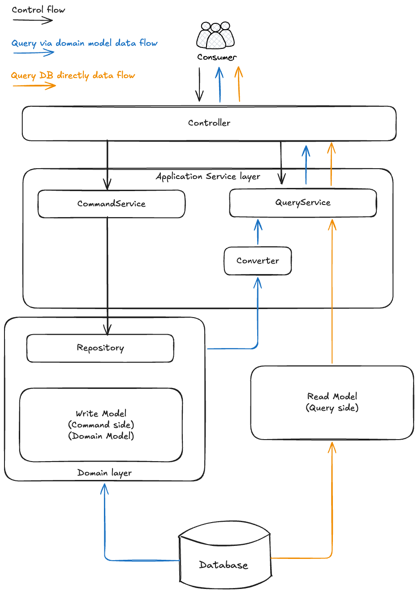

# Use CQRS

## Context

Software usually provides two types of operations: the **write** side and the **read** side. Write operations represent
some
commands you send to you software to do something which usually results in data changes, and the read side merely
queries some data without changing the
software state. Write is also called **command** and read is also called **query**.

When it comes to implementation, command and query can be modeled with the same set of objects. Or they can be treated
separately using different models, which is
called [Command Query Responsibility Segregation (CQRS)](https://learn.microsoft.com/en-us/dotnet/architecture/microservices/microservice-ddd-cqrs-patterns/apply-simplified-microservice-cqrs-ddd-patterns).

CQRS can be full scale or lightweight.

In full scale CQRS, the command side and query side uses different database
tables to hold data, a message middleware is usually used to synchronize data from command side to query side. The
coding models are also different.

In lightweight CQRS, the command side and query side use different coding models but the same database table, which is
simpler than full scale CQRS.

## Decision

We choose to use **lightweight CQRS**, because we believe that the command side and query side are essentially very
different. In command side, business rules should be strictly validated and the
business logic should be modeled
according to commonly accepted principles like [SOLID](https://en.wikipedia.org/wiki/SOLID)
and [GRASP](https://en.wikipedia.org/wiki/GRASP_(object-oriented_design)). In query side, the restrictions are more
loosen, and we can use whatever means to hit the database for fast and high performant queries.

Also, we think CQRS should not be a heavyweight architecture that scares developers away, but should be just enough to
fulfil its job.

Based on the above, the **lightweight CQRS** approach meets our needs and is our way to go. Meanwhile, you can still
firstly fetch domain models using `Repository` and then convert to query models.



## Implementation

- For the command side, use CommandService orchestrate the writing process, normally Repository is used for access
  Aggregate Roots, and the Aggregate Roots contains the domain logic.

```java
@Transactional
public void updateEquipmentName(String id, UpdateEquipmentNameCommand command, Operator operator) {
        Equipment equipment = equipmentRepository.byId(id, operator.getOrgId());
        equipmentDomainService.updateEquipmentName(equipment, command.name());
        equipmentRepository.save(equipment);
        log.info("Updated name for Equipment[{}].", equipment.getId());
}
```

- Apart from CommandServices, we create standalone QueryServices to implement the query side. In
  QueryService, we use `MongoTemplate` to query database directly, bypassing the domain models, and also we use a
  separate set of query objects other than domain objects. For example, in `EquipmentQueryService.pageEquipments()`, we
  don't use the domain object `Equipment`, instead a query model `QPagedEquipment` is used.

```java
public PagedResponse<QPagedEquipment> pageEquipments(PageEquipmentsQuery query, Operator operator) {
  Criteria criteria = where(AggregateRoot.Fields.orgId).is(operator.getOrgId());

  // more code omitted

  // use query model QPagedEquipment instead of domain model Equipment
  List<QPagedEquipment> equipments = mongoTemplate.find(query.with(pageable), QPagedEquipment.class, EQUIPMENT_COLLECTION);
  return new PagedResponse<>(equipments, pageable, count);
}
```

- Database table serves as a container for both command side data and query side data. For
  example, in `Equipment`, besides its own coherent business fields, the `maintenanceRecordCount` is added for the query
  side.

```java
public class Equipment extends AggregateRoot {
  private String name;
  private EquipmentStatus status;
  private String holder;
  private long maintenanceRecordCount; // Query side field
}
```

