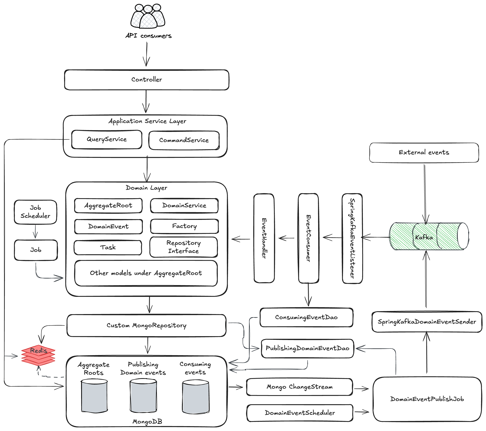
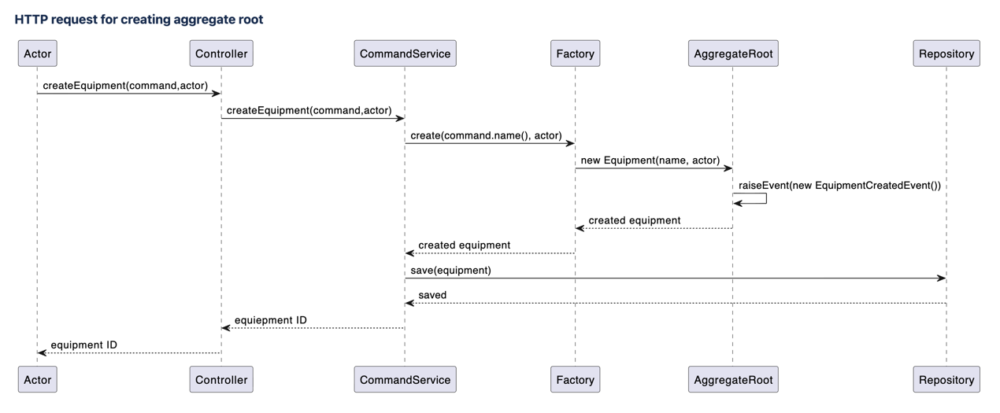
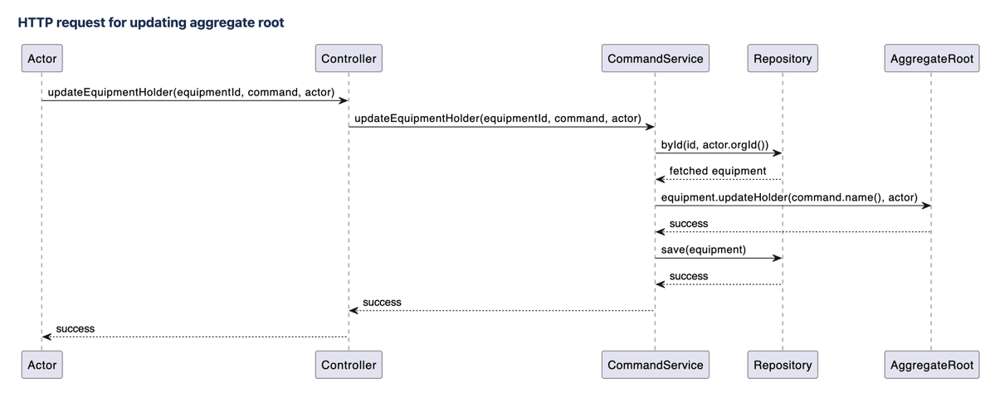
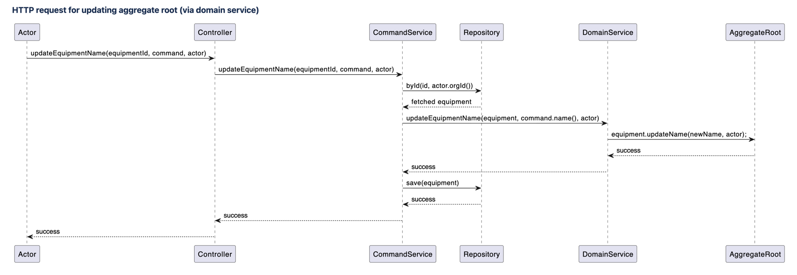
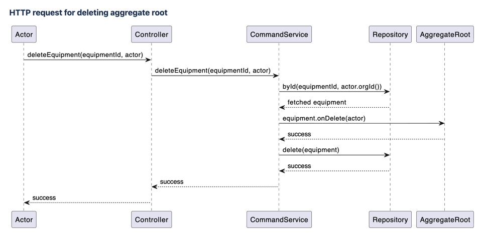
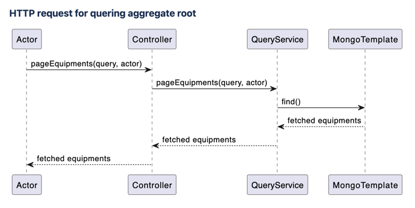
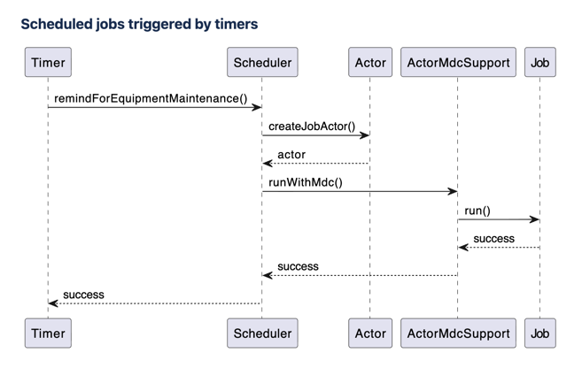
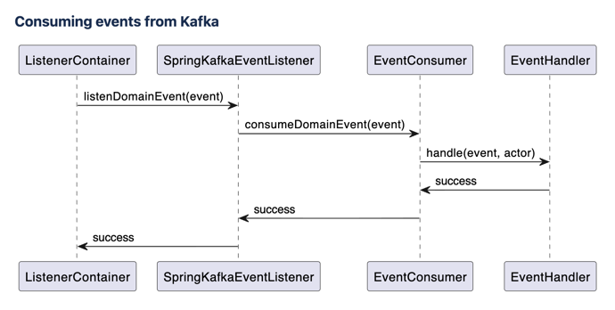

# Request process flow

## Context

Aggregate Root is the most important concepts in domain model. Nearly all operations in the software are centered around
Aggregate Roots. Different types of operations might have their own process flows.

## Decision

We choose to follow a standard way to implement various **request process flows**.

## Implementation

todo: add test for every flow

### Overall architecture



There are mainly 3 ways to interact with the software:

- Send HTTP request to the application
- Scheduled jobs triggered by timers
- Consuming events from Kafka

For HTTP requests, they can be further split into multiple sub-categories.

Given above, we have the following process flows:

- [HTTP request for creating aggregate root](#http-request-for-creating-aggregate-root)
- [HTTP request for updating aggregate root](#http-request-for-updating-aggregate-root)
- [HTTP request for deleting aggregate root](#http-request-for-deleting-aggregate-root)
- [HTTP request for querying aggregate root](#http-request-for-querying-aggregate-root)
- [Scheduled jobs triggered by timers](#scheduled-jobs-triggered-by-timers)
- [Consuming events from Kafka](#consuming-events-from-kafka)

### HTTP request for creating aggregate root

Creating data involves 2 major steps: Create and Save. Take "Creating an equipment" as an example, the request process
flow is:



1. `EquipmentController` receives the request:

```java
    @PostMapping
    @ResponseStatus(CREATED)
    @Operation(summary = "Create an equipment")
    public ResponseId createEquipment(@RequestBody @Valid CreateEquipmentCommand command, @AuthenticationPrincipal Actor actor) {
        return new ResponseId(this.equipmentCommandService.createEquipment(command, actor));
    }
```

2. `EquipmentCommandService` orchestrates the creation process:

```java
@Transactional
public String createEquipment(CreateEquipmentCommand command, Actor actor) {
  Equipment equipment = equipmentFactory.create(command.name(), actor);
  equipmentRepository.save(equipment);
  log.info("Created Equipment[{}].", equipment.getId());
  return equipment.getId();
}
```

3. `EquipmentFactory` creates the `Equipment` object. Remember, for code consistency, always use factory to create
   aggregate roots:

```java
public class EquipmentFactory {
  public Equipment create(String name, Actor actor) {
    return new Equipment(name, actor);
  }
}
```

4. `Equipment` constructor generates the ID for `Equipment` using `newEquipmentId()`, then sets data fields, and raises
   `EquipmentCreatedEvent` using `raiseEvent()`. The `EquipmentCreatedEvent` will be sent to Kafka automatically by the
   event infrastructure and no further actions are required from your side:

```java
public Equipment(String name, Actor actor) {
  super(newEquipmentId(), actor);
  this.name = name;
  raiseEvent(new EquipmentCreatedEvent(this, actor));
}

public static String newEquipmentId() {
  return "EQP" + newSnowflakeId(); // Generate ID in the code
}
```

5. `EquipmentRepository` saves the newly created `Equipment` object:

```java
public class EquipmentRepository extends AbstractMongoRepository<Equipment> {
  void save(Equipment equipment);
}
```

6. Return the ID of the newly created `Equipment` object to the caller.

### HTTP request for updating aggregate root

Updating data has 3 major steps: (1)Load the Aggregate Root; (2)Call Aggregate Root's business method; (3) Save it back
to database. Take "updating `Equipment`'s holder name" as an example.



1. `EquipmentController` receives the request:

```java
    @Operation(summary = "Update an equipment's holder")
    @PutMapping("/{equipmentId}/holder")
    public void updateEquipmentHolder(@PathVariable("equipmentId") @NotBlank String equipmentId,
                                      @RequestBody @Valid UpdateEquipmentHolderCommand command,
                                      @AuthenticationPrincipal Actor actor) {
        this.equipmentCommandService.updateEquipmentHolder(equipmentId, command, actor);
    }
```

2. `EquipmentCommandService` orchestrates the update process:

```java
    @Transactional
    public void updateEquipmentHolder(String id, UpdateEquipmentHolderCommand command, Actor actor) {
        Equipment equipment = equipmentRepository.byId(id, actor.orgId());
        equipment.updateHolder(command.name(), actor);
        equipmentRepository.save(equipment);
        log.info("Updated holder for Equipment[{}].", equipment.getId());
    }
```

3. `EquipmentRepository` loads `Equipment` by its ID:

```java
Equipment equipment = equipmentRepository.byId(id, actor.getOrgId());
```

4. `Equipment`'s `updateHolder()` is called to update its state according business logic(rules), and also raise
   `EquipmentHolderUpdatedEvent` if the holder name is changed:

```java
    public void updateHolder(String newHolder, Actor actor) {
        if (Objects.equals(this.holder, newHolder)) {
            return;
        }
        
        String oldHolder = this.holder;
        this.holder = newHolder;
        raiseEvent(new EquipmentHolderUpdatedEvent(oldHolder, newHolder, this, actor));
    }
```

5. `EquipmentRepository` saves the updated `Equipment` back into database:

```java
equipmentRepository.save(equipment);
```

6. No need to return anything from `EquipmentCommandService.updateEquipmentHolder()`.

Sometimes, the whole business logic is not suitable to be put inside Aggregate Root like `Equipment.updateHolder()`. For
such cases, we can use DomainServices. For example, when updating `Equipment`'s name, we need to check if the name is
already been occupied, which cannot be fulfilled by `Equipment` itself. Instead of calling `Equipment.updateName()`
directly from `EquipmentCommandService`, domain service `EquipmentDomainService.updateEquipmentName()` is called from
`EquipmentCommandService`:




```java
@Transactional
public void updateEquipmentName(String id, UpdateEquipmentNameCommand command, Actor actor) {
  Equipment equipment = equipmentRepository.byId(id, actor.getOrgId());
  equipmentDomainService.updateEquipmentName(equipment, command.name(), actor);
  equipmentRepository.save(equipment);
  log.info("Updated name for Equipment[{}].", equipment.getId());
}
```

Inside `EquipmentDomainService.updateEquipmentName()`, it first checks whether the name is already taken, if not then
update `Equipment`'s name:

```java
    public void updateEquipmentName(Equipment equipment, String newName, Actor actor) {
        if (!Objects.equals(newName, equipment.getName()) &&
            equipmentRepository.existsByName(newName, equipment.getOrgId())) {
            throw new ServiceException(EQUIPMENT_NAME_ALREADY_EXISTS,
                    "Equipment Name Already Exists.",
                    mapOf(AggregateRoot.Fields.id, equipment.getId(), Equipment.Fields.name, newName));
        }

        equipment.updateName(newName, actor);
    }
```

### HTTP request for deleting aggregate root

For deleting data, first load the `AggregateRoot` and then delete it. For example, for deleting an `Equipment`:




1. `EquipmentController` receives the request:

```java
    @Operation(summary = "Delete an equipment")
    @DeleteMapping("/{equipmentId}")
    public void deleteEquipment(@PathVariable("equipmentId") @NotBlank String equipmentId, @AuthenticationPrincipal Actor actor) {
        this.equipmentCommandService.deleteEquipment(equipmentId, actor);
    }
```

2. `EquipmentCommandService` orchestrates the deletion process:

```java
    @Transactional
    public void deleteEquipment(String equipmentId, Actor actor) {
        Equipment equipment = equipmentRepository.byId(equipmentId, actor.orgId());
        equipment.onDelete(actor);
        equipmentRepository.delete(equipment);
        log.info("Deleted Equipment[{}].", equipmentId);
    }
```

3. `EquipmentRepository` loads the `Equipment` by equipment ID and org ID:

```java
Equipment equipment = equipmentRepository.byId(equipmentId, actor.orgId());
```

4. `Equipment.onDelete()` is called to do some pre-deletion work such as raising domain events:

```java
    public void onDelete(Actor actor) {
        raiseEvent(new EquipmentDeletedEvent(this, actor));
    }
```

5. `EquipmentRepository` deletes the objects using `delete()`. You might be wondering why we need to first load the
   `Equipment` into memory then do the deletion. Will it be much simpler to directly delete by ID? The reason is that,
   before deletion, there might be some validations that need to happen, and also it might raise Domain Events. So, in
   order to ensure such possibilities, the whole `Equipment` object is loaded into the memory.

### HTTP request for querying aggregate root

There are two ways to query data:

1. Load the domain entity from DB using Repository, then convert the domain entity into response object
2. Use [CQRS](./004_use_lightweight_cqrs.md), namely bypass the domain layer and query the database directly, this is
   preferred as it does not couple with the domain layer and also fetches just enough data from database which improves
   performance

For using [CQRS](./004_use_lightweight_cqrs.md), querying data can bypass the domain models and talk to database
directly. For example, when querying a list of `Equipment`s:




1. The request hits `EquipmentController`, which further calls `EquipmentQueryService.pageEquipments()`:

```java
    @Operation(summary = "Query equipments")
    @PostMapping("/paged")
    public PagedResponse<QPagedEquipment> pageEquipments(@RequestBody @Valid PageEquipmentsQuery query, @AuthenticationPrincipal Actor actor) {
        return this.equipmentQueryService.pageEquipments(query, actor);
    }
```

`EquipmentQueryService` is at the same level with `EquipmentCommandService`, they both are under the category of
`ApplicationService`.

2. `EquipmentQueryService.pageEquipments()` uses `MongoTemplate` to query data from database directly, and uses its own
   query model `QPagedEquipment`:

```java
public PagedResponse<QPagedEquipment> pageEquipments(PageEquipmentsQuery query, Actor actor) {
  Criteria criteria = where(AggregateRoot.Fields.orgId).is(actor.getOrgId());

  if (isNotBlank(query.getSearch())) {
    criteria.and(Equipment.Fields.name).regex(query.getSearch());
  }

  // code omitted

  List<QPagedEquipment> equipments = mongoTemplate.find(query.with(pageable), QPagedEquipment.class, EQUIPMENT_COLLECTION);
  return new PagedResponse<>(equipments, pageable, count);
}
```

### Scheduled jobs triggered by timers



1. First create a scheduler in the `job` package:

```java
@Slf4j
@RequiredArgsConstructor
@Configuration(proxyBeanMethods = false)
public class EquipmentJobScheduler {
  private final MaintenanceReminderJob maintenanceReminderJob;

    @Scheduled(cron = "0 10 2 1 * ?")
    @SchedulerLock(name = "remindForEquipmentMaintenance")
    public void remindForEquipmentMaintenance() {
        assertLocked();

        Actor actor = createJobActor("remindForEquipmentMaintenance");
        ActorMdcSupport.runWithMdc(actor, this.maintenanceReminderJob::run);
    }
```

The `ActorMdcSupport.runWithMdc()` is used to set the `Actor` information into MDC.

2. Then create a job class:

```java
@Slf4j
@Component
@RequiredArgsConstructor
public class MaintenanceReminderJob {

  public void run() {
    log.info("MaintenanceReminderJob started.");

    //do something

    log.info("MaintenanceReminderJob ended.");
  }
}
```

The job class serves the same purpose as `CommandService`, which orchestrates various other components such as
`Repository`, `AggreateRoot` and `Factory`. Hence the job itself should not contain business logic.

### Consuming events from Kafka

The Kafka event consuming infrastructure is already set up for you. You only need to do 2 things for consuming events.




1. Make sure the topic is subscribed in `SpringKafkaEventListener` by configuring
   `topics = {KAFKA_DOMAIN_EVENT_TOPIC},`:

```java
@Slf4j
@Component
@DisableForIT // Disable Kafka Listener for integration tests
@RequiredArgsConstructor
public class SpringKafkaEventListener {
    private final EventConsumer eventConsumer;

    // Listen to domain events which are published by ourselves
    @KafkaListener(id = "domain-event-listener",
            groupId = "domain-event-listener",
            topics = {KAFKA_DOMAIN_EVENT_TOPIC},
            concurrency = "3")
    public void listenDomainEvent(DomainEvent event) {
        this.eventConsumer.consumeDomainEvent(event);
    }

    // You may add more @KafkaListener annotated methods for different topics if needed

}
```

You may add more `@KafkaListener` methods for consuming different topics if needed.

2. Create an EventHandler class that extends `AbstractEventHandler`:

```java
@Slf4j
@Component
@RequiredArgsConstructor
public class EquipmentCreatedEventHandler extends AbstractEventHandler<EquipmentCreatedEvent> {

  @Override
  public void handle(EquipmentCreatedEvent event, Actor actor) {
  }
}
```

The `EventHandler` serves the same purpose as `CommandService`, which orchestrates various other components such as
`Repository`, `AggreateRoot` and `Factory`. Hence, the `EventHandler` itself should not contain business logic.
