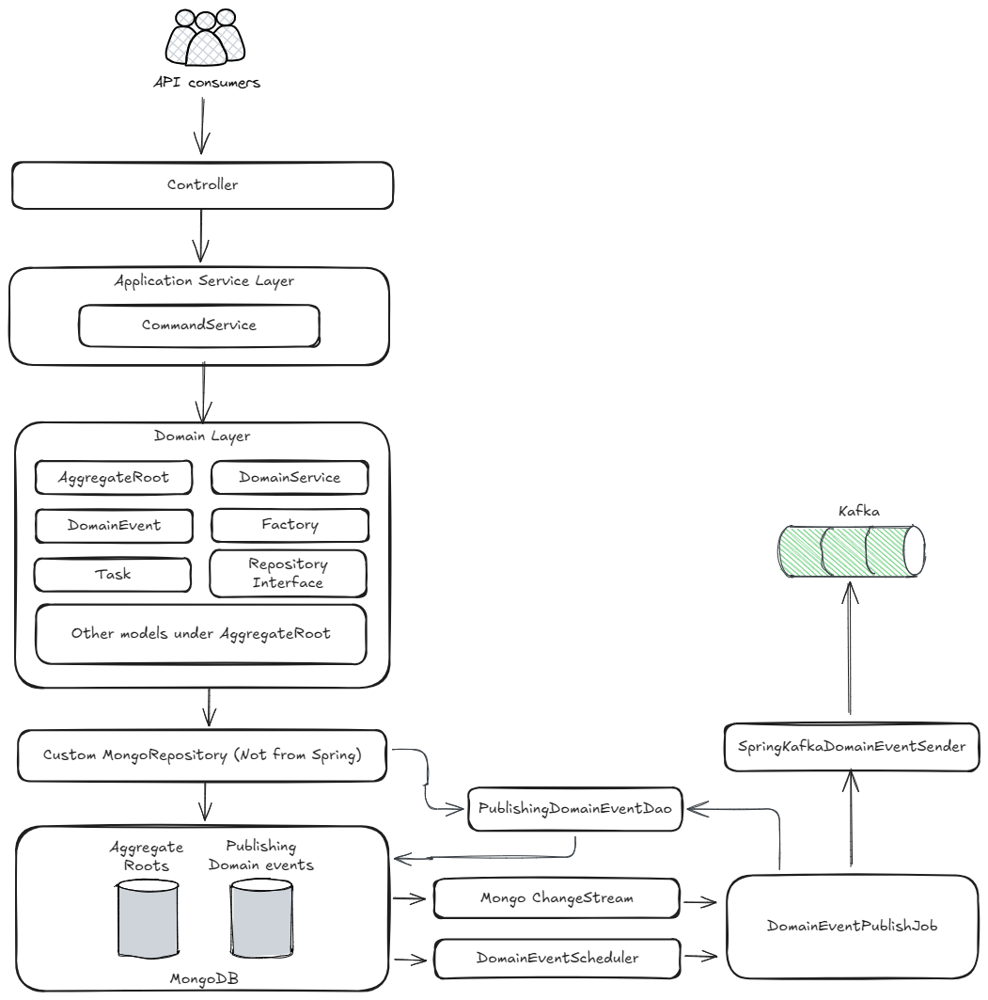

# Domain event publishing

## Context

Publishing Domain Events can be as easy as calling `kafkaTemplate.send()` whenever you need to. But doing so has a
problem:

- In normal use cases we will firstly write to database and then send events to Kafka, yet these two operations cannot
  be
  made inside an atomic operation, which might
  result in data inconsistency. For example, the writing to database succeeds but sending events to Kafka fails, or vice
  vasa. This kind of problem is essentially a distributed transaction problem.

Some techniques exist to address such problem, like [JTA](http://en.wikipedia.org/wiki/Jakarta_Transactions)
or [X/Open XA](https://en.wikipedia.org/wiki/X/Open_XA), but these techniques are usually quite heavy and Kafka does not
support them any way. There is also another technique
called [Transactional Outbox](https://microservices.io/patterns/data/transactional-outbox.html) pattern, which uses an
event table in database to convert a distributed transaction into a local database transaction.

## Decision

We choose to use the **Transactional Outbox** pattern for sending Domain Events to Kafka because it's proven to be
working,
and
there is hardly another easy and doable way for distributed transactions that covers both databases and messaging
systems
like Kafka.

One caveat with the Transactional Outbox pattern is that it might result in duplicated messages, which requires the
consumer to be idempotent. But don't worry about this as we have solutions for such case, please
refer to [event consuming](./009_event_consuming.md) for more detail.

## Implementation

- For sending a Domain Event, the only action that you need is calling `raiseEvent()` from an Aggregate Root:

```java
public void updateName(String newName) {
  if (Objects.equals(newName, this.name)) {
    return;
  }
  this.name = newName;
  raiseEvent(new EquipmentNameUpdatedEvent(name, this));
}
```

After the entity is saved into MongoDB, the event infrastructure will take care of sending the raised event into Kafka
automatically.

More details on creating domain events please refer
to [object implementation patterns](./007_object_implementation_patterns.md#domain-event).

#### Domain event publishing architecture



The following steps are already been implemented for you, but for illustration let's walk them through.

- After `AggregateRoot.raiseEvent()` is called, the event is stored inside the Aggregate Root object temporarily:

```java
protected final void raiseEvent(DomainEvent event) {
  requireNonNull(event, "event must not be null.");
  requireNonNull(event.getType(), "event's type must not be null.");
  requireNonBlank(event.getArId(), "event's arId must not be null.");

  events().add(event);
}
```

- Then when you save the Aggregate Root object by calling `AbstractMongoRepository.save()`, the event will be
  staged(saved) into a MongoDB collection named `publishing-event`:

```java
//AbstractMongoRepository

@Transactional
public void save(AR ar) {
  requireNonNull(ar, arType() + " must not be null.");
  requireNonBlank(ar.getId(), arType() + " ID must not be blank.");

  ar.onModify(currentOperator.id());
  mongoTemplate.save(ar);
  stageEvents(ar.getEvents());
  ar.clearEvents();
}

private void stageEvents(List<DomainEvent> events) {
  if (isNotEmpty(events)) {
    List<DomainEvent> orderedEvents = events.stream().sorted(comparing(DomainEvent::getRaisedAt)).toList();
    String raisedBy = currentOperator.id();
    orderedEvents.forEach(event -> event.raisedBy(raisedBy));
    publishingDomainEventDao.stage(orderedEvents);
  }
}
```

```java
//PublishingDomainEventDao

public void stage(List<DomainEvent> events) {
  requireNonNull(events, "Domain events must not be null.");
  List<PublishingDomainEvent> publishingDomainEvents = events.stream().map(PublishingDomainEvent::new).toList();
  mongoTemplate.insertAll(publishingDomainEvents);
}
```

As the Domain Event is saved into the database along with Aggregate Root in the same database transaction, we ensure
that they either be saved together
or rollback together.

- Once the event is inserted into MongoDB collection,
  MongoDB [Change Stream](https://www.mongodb.com/docs/manual/changestreams/) is triggered automatically due to
  configuration in `EventConfiguration`:

```java

@Bean(destroyMethod = "stop")
MessageListenerContainer mongoDomainEventChangeStreamListenerContainer(
    MongoTemplate mongoTemplate,
    TaskExecutor taskExecutor,
    DomainEventPublishJob domainEventPublishJob) {
  MessageListenerContainer container = new DefaultMessageListenerContainer(mongoTemplate, taskExecutor);

  // Get notification on DomainEvent insertion in MongoDB, then publish staged Domain Events to messaging middleware such as Kafka
  container.register(ChangeStreamRequest.builder(
          (MessageListener<ChangeStreamDocument<Document>, PublishingDomainEvent>) message -> {
            domainEventPublishJob.publishStagedDomainEvents(100);
          })
      .collection(PUBLISHING_EVENT_COLLECTION)
      .filter(new Document("$match", new Document("operationType", OperationType.INSERT.getValue())))
      .build(), PublishingDomainEvent.class);
  container.start();
  return container;
}
```

Upon receiving MongoDB Change Streams on event insertion, we are not sending the currently inserted event into Kafka
directly, instead we
treat this change merely as a trigger, which calls `DomainEventPublishJob.publishStagedDomainEvents()` to start the
publishing of Domain Events to Kafka.

- The `DomainEventPublishJob.publishStagedDomainEvents()` method loads all un-published events from the
  `publishing-event`
  collection and send them to Kafka in the order they are created:

```java
public void publishStagedDomainEvents(int batchSize) {
  if (batchSize > MAX_BATCH_SIZE || batchSize < 1) {
    throw new IllegalArgumentException("batchSize must be greater than or equal to 1 and less than 500.");
  }

  try {
    // Use a distributed lock to ensure only one node get run as a time, otherwise it may easily result in duplicated events
    var result = lockingTaskExecutor.executeWithLock(() -> doPublishStagedDomainEvents(batchSize),
        new LockConfiguration(now(), "publish-domain-events", ofMinutes(1), ofMillis(1)));
    List<String> publishedEventIds = result.getResult();
    if (isNotEmpty(publishedEventIds)) {
      log.debug("Published domain events {}.", publishedEventIds);
    }
  } catch (Throwable e) {
    log.error("Error happened while publish domain events.", e);
  }
}
```

- Once the event is sent to Kafka, the event in the database will be marked as sent. This also creates a distributed
  transaction problem. Here we tolerate duplicated messages to address this distributed transaction problem, namely if
  the sending of events succeeds but the marking of sent fails, the event will not be marked as sent and will be retried
  again which results in
  duplicated messages. By making the event consumers idempotent we are able to fix the duplicated message problem.
