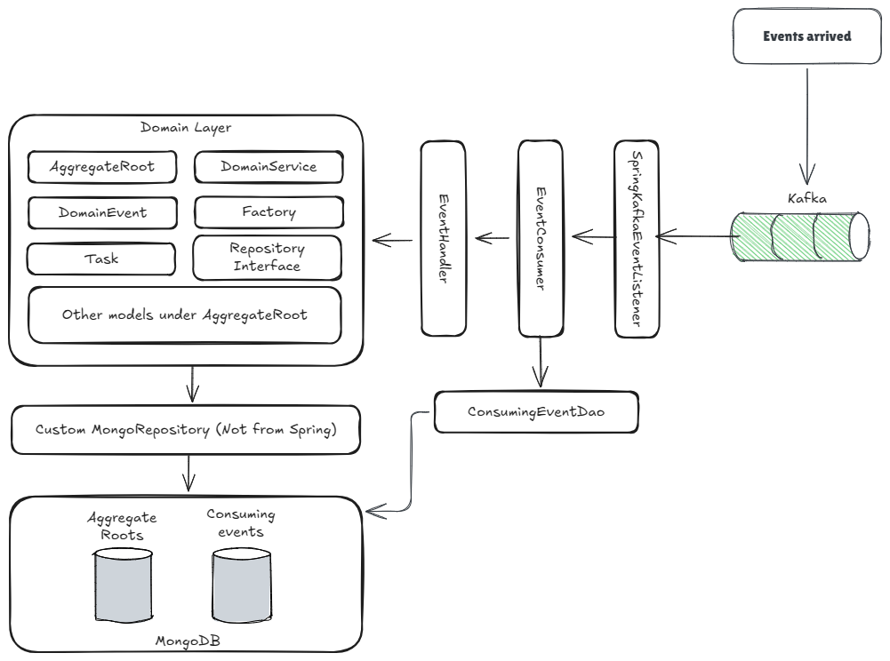

# Event consuming

## Context

Event consuming can be as easy as writing a listener method annotated with `@KafkaListener`, or it can be quite complex
given issues like ordering, idempotency, retry and dead letter handling etc.

## Decision

In order to find a balance between simplicity and comprehensiveness, we choose to follow these strategies when consuming
events:

- Every event can be handled by multiple handlers, these handlers process the same event independently, exceptions from
  one handler does not impact other handlers
- For multiple handlers processing the same event, higher priority handler process the event earlier
- Upon exceptions, the event will be retried 3 times within the same consuming thread, accumulated for all handlers but
  not within a single handler. If retry exhausts, the
  event will be put into Dead Letter Topic(DLT), for simplicity there is no automatic listener on DLT hence human
  investigation and action is needed
- Event consuming idempotency is achieved by either:
    - making the handler itself idempotent
    - or using `consuming-event` table to record consumed events, this prevents events from being consumed a second time
      by the same handler, hence idempotency is achieved on a "handler per event" basis
- Event handlers can be configured to work within a transaction

## Implementation

- When consuming an event, the only thing from your side is to create an event handler class that
  extends [AbstractEventHandler](../src/main/java/com/company/andy/common/event/consume/AbstractEventHandler.java), and
  make
  sure the event's topic is subscribed to
  in [SpringKafkaEventListener](../src/main/java/com/company/andy/common/event/consume/infrastructure/SpringKafkaEventListener.java)
- Example event handler:

```java
@Slf4j
@Component
@RequiredArgsConstructor
public class EquipmentCreatedEventHandler extends AbstractEventHandler<EquipmentCreatedEvent> {

  @Override
  public void handle(EquipmentCreatedEvent event) {
  }
}
```

By declaring `EquipmentCreatedEventHandler` as above, the event consuming
infrastructure([EventConsumer](../src/main/java/com/company/andy/common/event/consume/EventConsumer.java)) knows that it
handles
events with type `EquipmentCreatedEvent`.

- When
  extending [AbstractEventHandler](../src/main/java/com/company/andy/common/event/consume/AbstractEventHandler.java),
  you
  may
  override the following methods:
    - `isIdempotent()`: Returns `true` if the handler itself is idempotent, if `false` is returned, the
      `consuming-event` table will be used to achieve idempotency.
    - `isTransactional()`: Returns `true` to put the handler inside a transaction
    - `priority()`: return a number indicating the priority of the handler, lower number means higher priority and
      will be process earlier if multiple handlers consume the same event

- The combination of `isIdempotent()` and `isTransactional()` work as below:
    - If `isIdempotent()` return `false` and `isTransactional()` return `true`, the `consuming-event` table is used for
      idempotency, both the `consuming-event` table and the handler will be put inside the same transaction, this is the
      most common case
    - If `isIdempotent()` return `false` and `isTransactional()` return `false`, the `consuming-event` table is used for
      idempotency, but there is no transactions, which means it could such happen that the event is marked as consumed
      regardless of whether the handler succeeds or not, hence when retry the handler will not be retried
    - If `isIdempotent()` return `true` and `isTransactional()` return `true`, the `consuming-event` table is not used
      for
      idempotency as the handler is already idempotent itself, also the handler will be put inside a transaction
    - If `isIdempotent()` return `true` and `isTransactional()` return `false`, the `consuming-event` table is not used
      for
      idempotency as the handler is already idempotent itself, the handler will not be put inside a transaction
- During the processing of events, new events can be raised by calling `AggregateRoot.raiseEvent()`

## Event consuming infrastructure



The below section explains how the event consuming infrastructure works.

- [SpringKafkaEventListener](../src/main/java/com/company/andy/common/event/consume/infrastructure/SpringKafkaEventListener.java)
  is the entry point of the whole event consuming process, it's also the only place that Kafka is referenced
- Multiple `@KafkaListener` methods can be added inside `SpringKafkaEventListener` to listen to multiple categories of
  events

```java
public class SpringKafkaEventListener {
  private final EventConsumer eventConsumer;

  @KafkaListener(id = "domain-event-listener",
      groupId = "domain-event-listener",
      topics = {KAFKA_DOMAIN_EVENT_TOPIC},
      concurrency = "3")
  public void listenDomainEvent(DomainEvent event) {
    this.eventConsumer.consumeDomainEvent(event);
  }

  // add more listeners
}
```

- `SpringKafkaEventListener` passes the event
  to [EventConsumer](../src/main/java/com/company/andy/common/event/consume/EventConsumer.java). `EventConsumer` is
  agnostic to
  messaging middlewares, and it manages all handlers. The below code uses `consumeDomainEvent(DomainEvent event)` to
  handle Domain Events. If you are also consuming other types of events from other external systems, you may add more
  methods in addition to `consumeDomainEvent()`, like `consumeXxxEvent(XxxEvent event)`

```java
public void consumeDomainEvent(DomainEvent event) { // This works for all sub-types of DomainEvent
  this.consume(new ConsumingEvent(event.getId(), event));
}

public void consumeXxxEvent(XxxEvent event) { // This works for all sub-types of XxxEvent
  this.consume(new ConsumingEvent(event.getId(), event));
}
```

- `EventConsumer` finds all handlers that can handle the event, and calls their `handle()` methods, the handlers'
  `priority`, `isTransactional()` and `isIdempotent()` are checked during this orchestration process
- A wrapper class [ConsumingEvent](../src/main/java/com/company/andy/common/event/consume/ConsumingEvent.java) is
  created to
  enable uniform handling of various types of events, not only Domain Events
- `EventConsumer` uses `ConsumingEventDao.markEventAsConsumedByHandler()` to implement idempotency if the handler is not
  idempotent by itself, under the
  hood [ConsumingEventDao](../src/main/java/com/company/andy/common/event/consume/ConsumingEventDao.java) uses a table
  named
  `consuming-event` to achieve idempotency

```java
// return true means this event has never been consumed before
public boolean markEventAsConsumedByHandler(ConsumingEvent consumingEvent, AbstractEventHandler<?> handler) {
  Query query = query(where(eventId).is(consumingEvent.getEventId()).and(ConsumingEvent.Fields.handler).is(handler.getName()));

  Update update = new Update()
      .setOnInsert(type, consumingEvent.getType())
      .setOnInsert(event, consumingEvent.getEvent())
      .setOnInsert(consumedAt, consumingEvent.getConsumedAt());

  UpdateResult result = this.mongoTemplate.update(ConsumingEvent.class)
      .matching(query)
      .apply(update)
      .upsert();

  return result.getMatchedCount() == 0;
}
```

- The `ConsumingEventDao` achieves idempotency based on the event's ID and the event handler's fully qualified class
  name(FQCN) together, hence best not to rename or change package location of event handler classes after their
  creation,
  otherwise the idempotency mechanism might not work
- A `DefaultErrorHandler` is configured
  in [EventConfiguration](../src/main/java/com/company/andy/common/event/EventConfiguration.java) to retry the event for
  at
  most 3 times, then put the event into DLT if retry exhausts. If the event is consumed by multiple handlers, any
  handler that raises exception will result in retry on all handlers.

```java
@Bean
public DefaultErrorHandler defaultErrorHandler(KafkaTemplate<String, Object> kafkaTemplate) {
  ExponentialBackOff backOff = new ExponentialBackOff(500L, 2);
  backOff.setMaxAttempts(2); // the message will be processed at most [2 + 1 = 3] times
  DeadLetterPublishingRecoverer recoverer = new DeadLetterPublishingRecoverer(
      kafkaTemplate,
      (record, ex) -> {
        String dlt = record.topic() + dltSuffix;
        log.error("Error consuming message[key={}], moving to dead letter topic[{}].", record.key(), dlt, ex);
        return new TopicPartition(dlt, record.partition());
      }
  );
  return new DefaultErrorHandler(recoverer, backOff);
}
```
