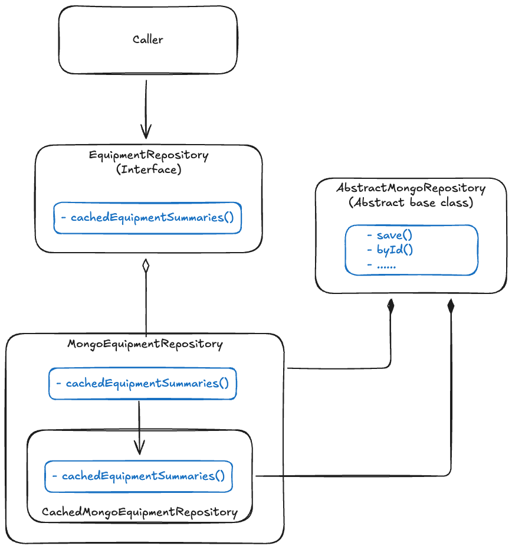

# Cache strategy

## Context

Cache should be used to enhance performance.

## Decision

We implement cache on `Repository` layer. The caller should know whether to use cache methods or not, namely cache is
not transparent to
callers.

For updating data, you should retrieve it from the database directly, but not from cache. Cache is only for query data
for direct response to the client or for reference data.

## Implementation

The cache architecture (take `CachedMongoEquipmentRepository` as an example):



- Caller only knows the interface `EquipmentRepository`
- `Equipment`'s own repository `MongoEquipmentRepository` implements `EquipmentRepository` and extends
  `AbstractMongoRepository` for reusing common methods such as `byId()` and `save()`
- The cache repository `CachedMongoEquipmentRepository` also extends  `AbstractMongoRepository` for reusing common
  methods such as `byId()`
- `MongoEquipmentRepository` holds `CachedMongoEquipmentRepository` internally and proxies cache related methods to it, hence hides
  `CachedMongoEquipmentRepository` from
  the caller

In order to implement a cache object, go through the following steps:

1. Decide if exising objects should be cached or a new class should be created.
2. For new cache classes, it's often created with Java's Record, for example:

```java
@Builder
public record EquipmentSummary(String id,
                               String orgId,
                               String name,
                               EquipmentStatus status) {
}
```

3. Register the cache class
   into [CacheConfiguration](../src/main/java/com/company/andy/common/configuration/CacheConfiguration.java) using
   `withCacheConfiguration()`:

```java
@Bean
public RedisCacheManagerBuilderCustomizer redisBuilderCustomizer(ObjectMapper objectMapper) {
  return builder -> builder
      .cacheDefaults(defaultCacheConfig()
          .prefixCacheNameWith(Constants.CACHE_PREFIX)
          .serializeValuesWith(fromSerializer(new GenericJacksonJsonRedisSerializer(objectMapper)))
          .entryTtl(ofDays(7)))
      .withCacheConfiguration(ORG_EQUIPMENTS_CACHE, defaultCacheConfig()
          .prefixCacheNameWith(Constants.CACHE_PREFIX)
          .serializeValuesWith(fromSerializer(new JacksonJsonRedisSerializer<>(objectMapper, CachedOrgEquipmentSummaries.class)))
          .entryTtl(ofDays(7)))
      ;
}
```

4. Create a cache repository, this repository should only work for cache, callers should not use this repository
   directly:

```java
public class CachedMongoEquipmentRepository extends AbstractMongoRepository<Equipment> {

  @Cacheable(value = ORG_EQUIPMENTS_CACHE, key = "#orgId")
  public CachedOrgEquipmentSummaries cachedEquipmentSummaries(String orgId) {
    requireNonBlank(orgId, "orgId must not be blank.");

    Query query = query(where(AggregateRoot.Fields.orgId).is(orgId)).with(by(ASC, createdAt));
    query.fields().include(AggregateRoot.Fields.orgId, Equipment.Fields.name, Equipment.Fields.status);
    return new CachedOrgEquipmentSummaries(mongoTemplate.find(query, EquipmentSummary.class, EQUIPMENT_COLLECTION));
  }

  @Caching(evict = {@CacheEvict(value = ORG_EQUIPMENTS_CACHE, key = "#orgId")})
  public void evictCachedEquipmentSummaries(String orgId) {
    requireNonBlank(orgId, "orgId must not be blank.");

    log.debug("Evicted cached equipment summaries for org[{}].", orgId);
  }
}
```

5. Add cache related methods in the caller facing `Repository` interface:

```java
public interface EquipmentRepository {

  List<EquipmentSummary> cachedEquipmentSummaries(String orgId);

  void evictCachedEquipmentSummaries(String orgId);
}
```

6. Implement the cache methods by calling into the cache repository:

```java
public class MongoEquipmentRepository extends AbstractMongoRepository<Equipment> implements EquipmentRepository {
  private final CachedMongoEquipmentRepository cachedMongoEquipmentRepository;

  @Override
  public List<EquipmentSummary> cachedEquipmentSummaries(String orgId) {
    return cachedMongoEquipmentRepository.cachedEquipmentSummaries(orgId).summaries();
  }

  @Override
  public void evictCachedEquipmentSummaries(String orgId) {
    cachedMongoEquipmentRepository.evictCachedEquipmentSummaries(orgId);
  }
}
```

As you can see, the cache repository (`CachedMongoEquipmentRepository`) is hidden by `MongoEquipmentRepository`, the
caller code can just
use
`EquipmentRepository.cachedEquipmentSummaries()` to access caches.

7. In caller code, call `EquipmentRepository.cachedEquipmentSummaries()` explicitly to get the cached data:

```java
public List<EquipmentSummary> getAllEquipmentSummaries(Operator operator) {
  return equipmentRepository.cachedEquipmentSummaries(operator.getOrgId());
}
```